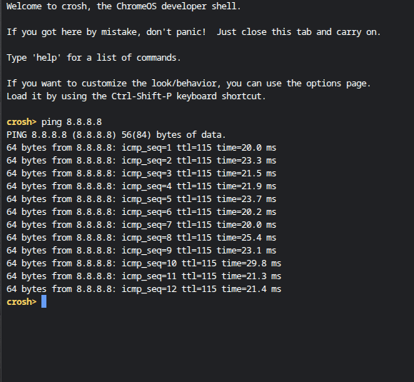

# Network Troubleshooting (DNS Test)

## Project Summary
In this project, I tested DNS and internet connectivity using command line tools.

## Tools Used
- Terminal
- ping command

## Environment
- Chromebook (crosh/Terminal)

## What I Did
I tested connectivity to external servers using Google's DNS (8.8.8.8).

## Steps Performed
1. Opened terminal  
2. Ran ping 8.8.8.8  
3. Observed response times  
4. Confirmed internet connectivity  

## Results
The test returned successful replies, confirming that the internet connection was active.

## Screenshots

## Conclusion
This project helped me understand how to test internet connectivity using DNS servers
